<div align="center">

<!-- � 3D ROTATING COFFEE LOGO 🎯 -->


<!-- 🏃 RUNNING EMOJIS ANIMATION 🏃 -->


<!-- 🌟✨ EPIC ANIMATED HEADER ✨🌟 -->


<!-- 🎪 MARQUEE ANNOUNCEMENT TICKER 🎪 -->


<!-- 🌟 EPIC WELCOME ANIMATION 🌟 -->


<!-- 🌈 ANIMATED NEON LINE 🌈 -->


<!-- Animated Typing Effect -->
[](https://git.io/typing-svg)

<!-- Animated Coffee -->


<!-- 🏆 TROPHY SHOWCASE 🏆 -->
<br>


<h4>🌟 Award-Winning Quality 🌟</h4>

<!-- 💫 ANIMATED SPARKLE LINE 💫 -->


<!-- 🏆 PROJECT HIGHLIGHTS 🏆 -->
<table>
<tr>
<td align="center">
<br>
<b>Started</b><br>
Dec 2025
</td>
<td align="center">
<br>
<b>Status</b><br>
Completed
</td>
<td align="center">
<br>
<b>Platform</b><br>
Desktop
</td>
<td align="center">
<br>
<b>Team</b><br>
6 Members
</td>
<td align="center">
<br>
<b>Files</b><br>
15+ Java
</td>
</tr>
</table>

<!-- Visitor Counter -->


<!-- 🐍 ANIMATED CONTRIBUTION SNAKE 🐍 -->
<br>
<picture>
  <source media="(prefers-color-scheme: dark)" srcset="https://raw.githubusercontent.com/platane/snk/output/github-contribution-grid-snake-dark.svg">
  <source media="(prefers-color-scheme: light)" srcset="https://raw.githubusercontent.com/platane/snk/output/github-contribution-grid-snake.svg">
  
</picture>

<!-- 🎉 ANIMATED CELEBRATION 🎉 -->
<br><br>


<br><br>

<!-- 🌀 SPINNING TECH WHEEL 🌀 -->


<!-- 🔮 3D ISOMETRIC TECH ICONS 🔮 -->
<p align="center">
  
</p>

<!-- 💫 HOLOGRAPHIC GRADIENT BADGES 💫 -->
<a href="#"></a>
<a href="#"></a>
<a href="#"></a>
<br>
<a href="#"></a>
<a href="#"></a>
<a href="#"></a>
<a href="#"></a>

[](https://github.com/abdullah-darahem/ZarCafe_System/stargazers)
[](https://github.com/abdullah-darahem/ZarCafe_System/network/members)
[](https://github.com/abdullah-darahem/ZarCafe_System/watchers)

<!-- 📊 GITHUB STATS CARDS 📊 -->
<br>

| 📈 Repository Stats | 🔥 Activity |
|:-------------------:|:-----------:|
|  |  |
|  |  |

<br>

<p align="center">
  <strong>A college-level Point of Sale (POS) desktop application developed as a software engineering project.</strong><br>
  This system streamlines coffee shop operations using a structured <b>Java Swing</b> interface and <b>MySQL</b> database.
</p>

[Features](#-key-features) • [Installation](#️-installation--setup-guide) • [Screenshots](#-application-tour) • [Team](#-team-members)

<br>

### 🎬 Watch Full Demo


[](https://drive.google.com/file/d/12ca1i_MeDqMy2uFxcE-72gWRjlKziEVQ/view)

*Click the button above to watch the complete 5-minute walkthrough*

<!-- ☕ ANIMATED COFFEE FACTS CAROUSEL ☕ -->
<br>


[](https://git.io/typing-svg)

<!-- 💬 INSPIRING QUOTE ROTATOR 💬 -->
<br>


[](https://git.io/typing-svg)

<br>

<!-- 🚀 EPIC ACTION BUTTONS 🚀 -->
<br>


**🎯 Quick Actions**

[](https://github.com/abdullah-darahem/ZarCafe_System.git)
[](https://github.com/abdullah-darahem/ZarCafe_System/archive/refs/heads/main.zip)
[](https://github.com/abdullah-darahem/ZarCafe_System/issues)
[](https://github.com/abdullah-darahem/ZarCafe_System/issues)

<!-- 💫 ANIMATED HAND WAVE 💫 -->
<br>


</div>

<!-- ✨ ANIMATED RAINBOW DIVIDER ✨ -->


## 📑 Table of Contents

<details>
<summary>Click to expand</summary>

- [Demo](#-watch-full-demo)
- [Application Tour](#-application-tour)
- [Key Features](#-key-features)
- [Tech Stack](#️-tech-stack)
- [Prerequisites](#-prerequisites)
- [Installation & Setup](#️-installation--setup-guide)
- [Project Structure](#-project-structure)
- [Troubleshooting](#-troubleshooting)
- [Future Enhancements](#-future-enhancements)
- [Contributing](#-contributing)
- [Team Members](#-team-members)
- [Changelog](#-changelog)
- [Acknowledgments](#-acknowledgments)

</details>

<!-- ✨ ANIMATED WAVE DIVIDER ✨ -->


<div align="center">

</div>

## 📸 Application Tour

<div align="center">

>  *Explore our beautiful, intuitive interface*

</div>

The application follows a structured user flow with **alphabetical prefixes (A → E)** for intuitive navigation.

<details open>
<summary>

</summary>
<br>

<!-- 🅰️ ENTRY POINT -->
<div align="center">


|  Welcome Screen  |
|:---:|
| 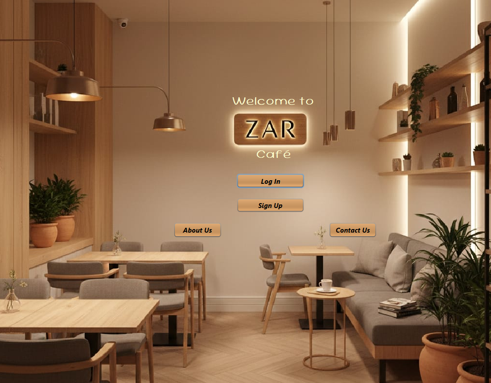 |
|  `A__Welcome.java` - Application launcher |
</div>


<!-- 🅱️ AUTHENTICATION MODULE -->
<div align="center">


|  Login |  Signup |
|:---:|:---:|
| 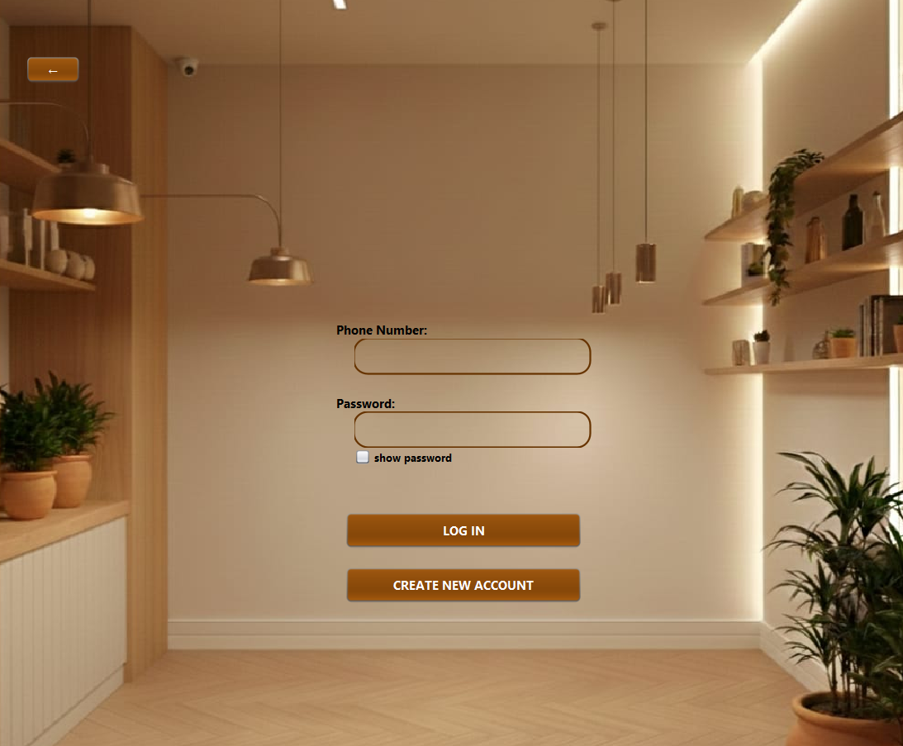 | 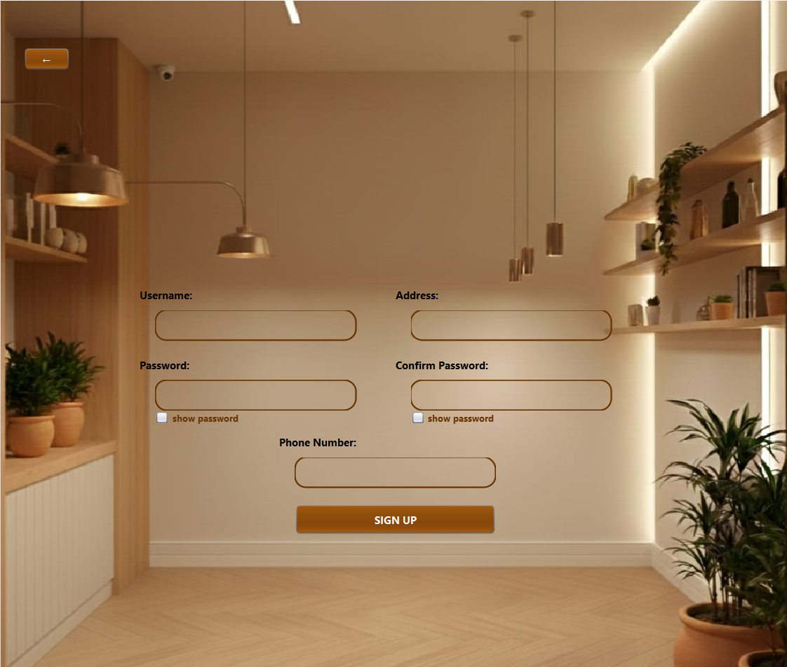 |
|  `B__Login.java` - Secure access |  `B__Signup.java` - New registration |
</div>


<!-- 🅲 INFORMATION CENTER -->
<div align="center">


|  About Us |  Contact Us |
|:---:|:---:|
| 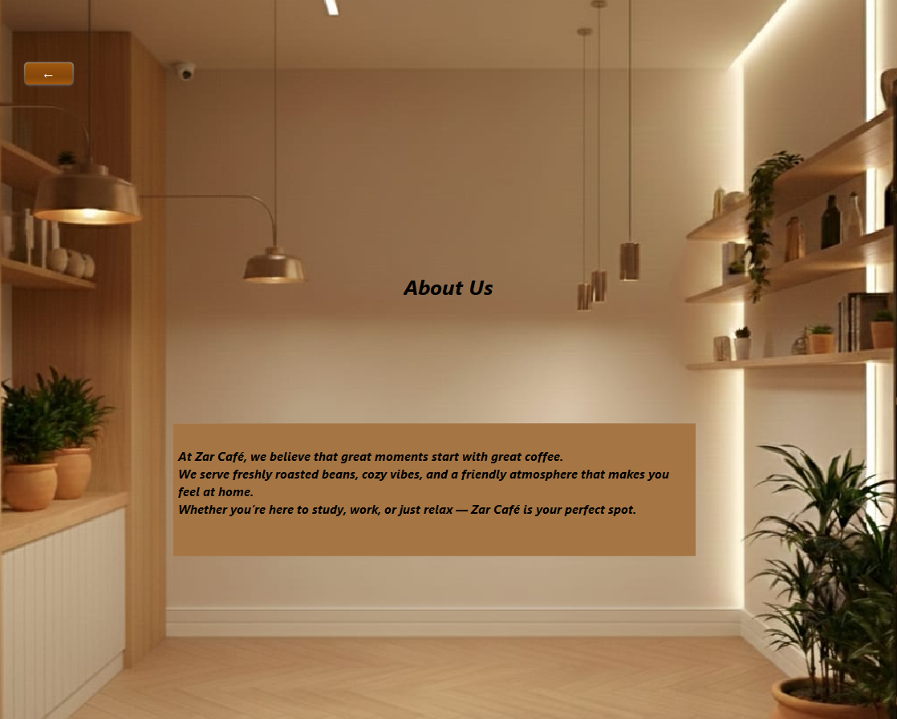 | 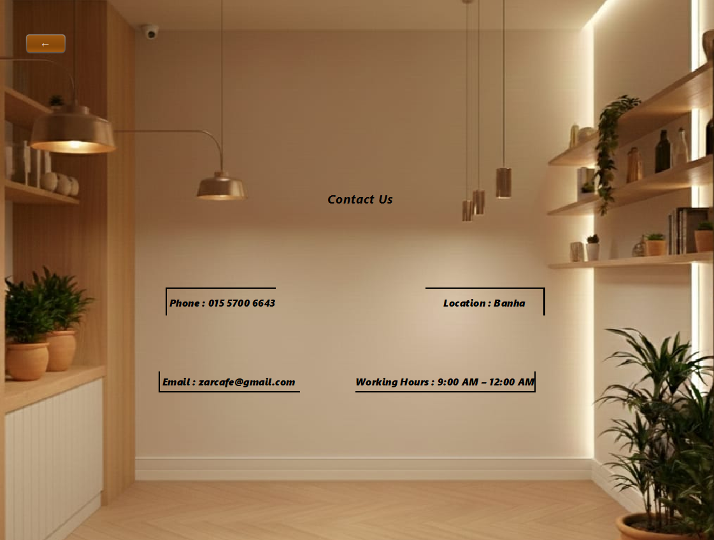 |
|  `C__About_us.java` |  `C__contact_us.java` |
</div>


<!-- 🅳 USER MODULE -->
<div align="center">


|  Order System |  Profile & Wallet |
|:---:|:---:|
| 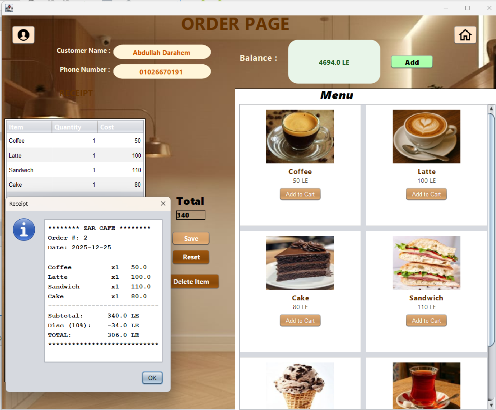 | 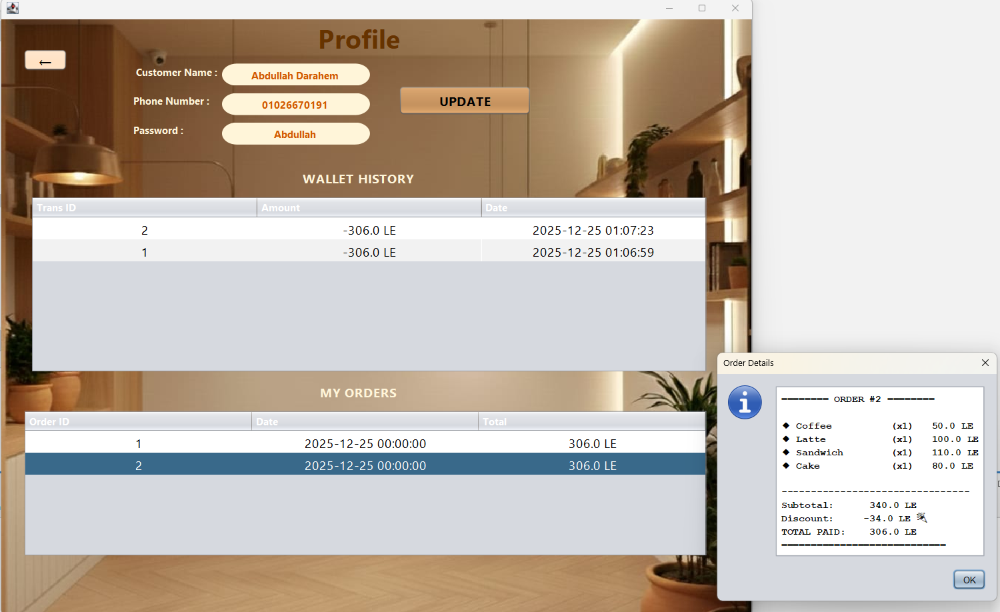 |
|  `D__User_ORDERS.java` - POS Interface |  `D__Order_PROFILE.java` - User Dashboard |
</div>


<!-- 🅴 ADMIN MODULE -->
<div align="center">


|  Dashboard |  Menu |  Sales |  Users |
|:---:|:---:|:---:|:---:|
| 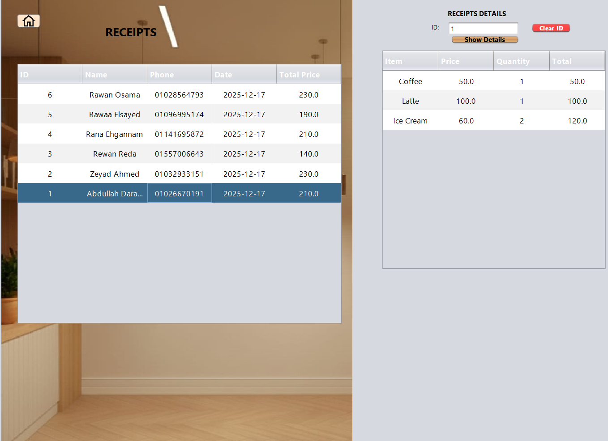 | 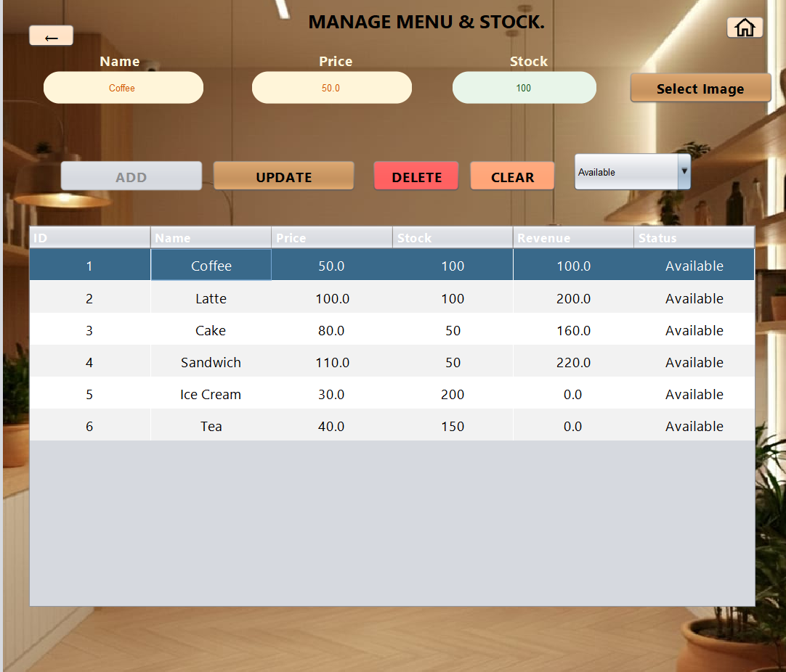 | 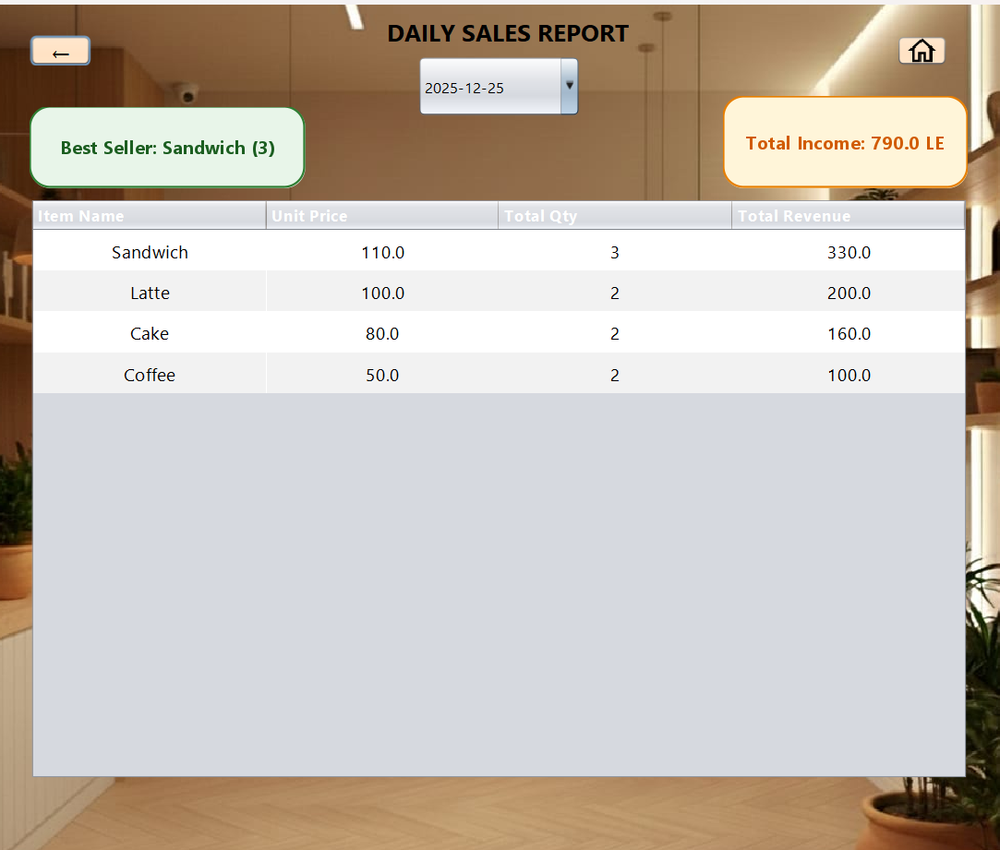 | 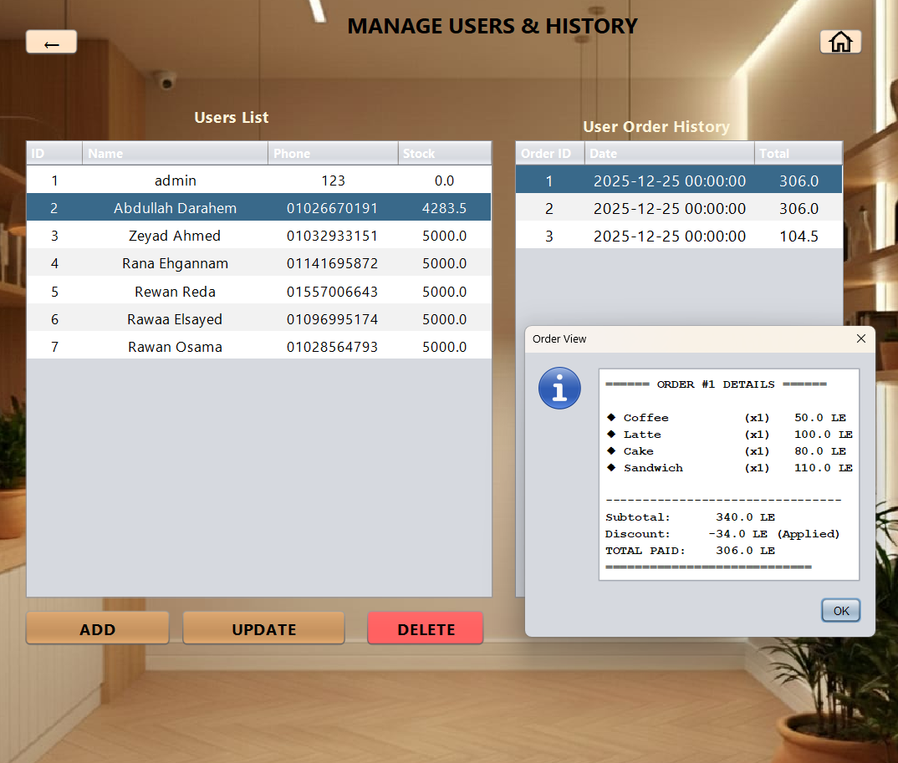 |
|  `E__Admin_1.java` |  `E__Admin_MENU.java` |  `E__Admin_SALES.java` |  `E__Admin_USERS.java` |
</div>

<br>


<i>Beautiful UI, isn't it?</i>


</details>

<!-- ✨ ANIMATED GRADIENT LINE ✨ -->


<div align="center">

</div>

<!-- 🌊 WAVE TEXT EFFECT 🌊 -->
<div align="center">

</div>

<!-- 📊 ANIMATED STATS COUNTER 📊 -->
<div align="center">
<table>
<tr>
<td align="center">
<br>
<br>
<b>Java Files</b>
</td>
<td align="center">
<br>
<br>
<b>Lines of Code</b>
</td>
<td align="center">
<br>
<br>
<b>Coffees</b>
</td>
<td align="center">
<br>
<br>
<b>Passion</b>
</td>
</tr>
</table>
</div>

<br>

### 👤 A. & B. User Access Control
* **Welcome Hub:** centralized entry point guiding users to login or register.
* **Role-Based Login:** secure authentication separating 'Admin' access from standard 'User' access.
* **Smart Signup:** streamlined registration form with duplicate phone validation.
* **🆕 Show/Hide Password:** toggle checkbox for password visibility in both fields.
* **🆕 Modern UI:** transparent text fields with rounded borders for a sleek look.

### 💰 Wallet System (NEW!)
* **Electronic Wallet:** each customer has a wallet balance for cashless transactions.
* **Transaction History:** complete log of deposits and withdrawals with timestamps.
* **Secure Payments:** deduct from wallet balance during checkout.

### 🛒 D. Order Processing (The Core)
* **Visual Menu:** categorized selection for Coffee, Bakery, and Desserts.
* **Dynamic Cart:** real-time bill calculation and item management.
* **🆕 Discount Support:** orders now support subtotal, discount, and final total.
* **Receipt Generation:** automated generation of order summaries.

### 👤 Profile & Order History (NEW!)
* **Profile Dashboard:** view wallet balance and personal info.
* **Order History Table:** browse all past orders in a clean table.
* **🆕 Quick Details (Double-Click):** double-click any order to see full item breakdown in a popup.

### 📊 E. Admin Administration
* **Sales Overview:** view daily earnings and transaction logs.
* **🆕 Full CRUD Control:** add, edit, and delete users with cascade deletion.
* **🆕 Safe Delete:** delete any user along with all their orders automatically.
* **Menu Management:** add new products, update prices, and manage inventory.

### ℹ️ C. Information Center
* **About & Contact:** dedicated interfaces providing project information and developer contact details.

<!-- ✨ ANIMATED GRADIENT LINE ✨ -->


<div align="center">

</div>

<!-- 💎 CRYSTAL DIAMOND DIVIDER 💎 -->
<div align="center">


</div>

<!-- ⚡ NEON GLOW TEXT ⚡ -->
<div align="center">

</div>

<div align="center">

>  *Built with industry-standard technologies*

| Component | Technology | Purpose |
|:---------:|:----------:|:--------|
|  | Java (JDK 8+) | Core Programming Language |
|  | Java Swing | GUI Framework |
|  | MySQL 5.7+ | Database Management |
|  | MySQL Connector | Database Connectivity |
|  | Apache NetBeans | Development IDE |

<!-- 📊 SKILL PROGRESS BARS 📊 -->
<br>

### 💪 Technology Proficiency

<!-- 📈 ANIMATED PROGRESS BARS 📈 -->

| Technology | Progress | Level |
|:----------:|:--------:|:-----:|
|  Java |  █████████░ | 🔥 Expert |
|  Swing UI |  ████████░░ | 💪 Advanced |
|  MySQL |  ████████░░ | 💪 Advanced |
|  JDBC |  ███████░░░ | 📚 Proficient |
|  UI/UX |  ██████░░░░ | 📚 Proficient |
|  Docs |  ██████████ | 🏆 Master |

 **Always learning, always growing!**

</div>

---

## 📋 Prerequisites

Before you begin, ensure you have the following installed:

| Requirement | Version | Download Link |
|:-----------:|:-------:|:-------------:|
| ☕ Java JDK | 8+ | [Download](https://www.oracle.com/java/technologies/downloads/) |
| 🗄️ MySQL Server | 5.7+ | [Download](https://dev.mysql.com/downloads/) |
| 💻 Apache NetBeans | Latest | [Download](https://netbeans.apache.org/download/) |

> 💡 **Tip:** You can also use [XAMPP](https://www.apachefriends.org/) which includes MySQL Server.

---

<div align="center">


</div>

<!-- 🌈 MORPHING GRADIENT SECTION 🌈 -->
<div align="center">

</div>

### ⚡ Quick Start

<!-- 🎬 ANIMATED CODE BLOCK 🎬 -->
<div align="center">

</div>

```bash
# 1. Clone the repository
git clone https://github.com/abdullah-darahem/ZarCafe_System.git

# 2. Import database/database_setup.sql into MySQL

# 3. Open project in NetBeans and run!
```

### 1. Database Setup 🗄️
1.  Open your SQL Server (Workbench or XAMPP).
2.  Import **`database_setup.sql`** from the `database/` folder.
3.  This creates the `ZAR_CAFE` DB and tables.

### 2. Configuration 🔌
Ensure database credentials match your local machine in `src/db/DBConnection.java`:
```java
private static final String URL = "jdbc:mysql://localhost:3306/ZAR_CAFE";
private static final String USER = "root"; // Check your username
private static final String PASSWORD = ""; // Check your password
```

### 3. Add JDBC Driver 📦
1.  Right-click your project → **Properties** → **Libraries**.
2.  Click **Add JAR/Folder** and select `lib/mysql-connector-java-x.x.x.jar`.

### 4. Run 🚀
Right-click the project and select **Run**.
* **Default Admin Credentials:**
    * Phone: `123`
    * Password: `admin123`
    
    > **Note:** For security purposes, please change these credentials after the first login or via the database.

---

<div align="center">

</div>

## 📂 Project Structure
```
ZarCafe_System/
├── 📁 src/
│   ├── 📁 ui/
│   │   ├── 📄 A__Welcome.java          # Entry point - Welcome screen
│   │   ├── 📄 B__Login.java            # User authentication
│   │   ├── 📄 B__Signup.java           # New user registration
│   │   ├── 📄 C__About_us.java         # Team information
│   │   ├── 📄 C__contact_us.java       # Contact details
│   │   ├── 📄 D__Order_PROFILE.java    # User profile & wallet
│   │   ├── 📄 D__User_ORDERS.java      # Order menu & cart
│   │   ├── 📄 E__Admin_1.java          # Admin main dashboard
│   │   ├── 📄 E__Admin_MENU.java       # Menu management
│   │   ├── 📄 E__Admin_SALES.java      # Sales reports
│   │   └── 📄 E__Admin_USERS.java      # User management (CRUD)
│   ├── 📁 db/
│   │   └── 📄 DBConnection.java        # Database connection handler
│   └── 📁 images/                      # Icons and assets
├── 📁 database/
│   └── 📄 database_setup.sql           # SQL schema & sample data
├── 📁 lib/
│   └── 📄 mysql-connector-j-x.x.x.jar  # JDBC Driver
├── 📁 screenshots/                     # UI screenshots
└── 📄 README.md
```

### 🏗️ Architecture Overview

```
┌─────────────────────────────────────────────────────────────────┐
│                        ZAR CAFE SYSTEM                          │
├─────────────────────────────────────────────────────────────────┤
│  ┌─────────┐    ┌─────────┐    ┌─────────┐    ┌─────────┐      │
│  │    A    │───▶│    B    │───▶│    C    │    │    D    │      │
│  │ Welcome │    │  Login  │    │  Info   │    │  User   │      │
│  └─────────┘    │ Signup  │    │ About   │    │ Orders  │      │
│                 └────┬────┘    │ Contact │    │ Profile │      │
│                      │         └─────────┘    └────┬────┘      │
│                      │                             │            │
│                      ▼                             │            │
│               ┌─────────────────────────────────┐  │            │
│               │            E - ADMIN            │◀─┘            │
│               │  Dashboard │ Menu │ Sales │ Users│              │
│               └─────────────────────────────────┘              │
│                              │                                  │
│                              ▼                                  │
│                    ┌─────────────────┐                         │
│                    │  MySQL Database │                         │
│                    └─────────────────┘                         │
└─────────────────────────────────────────────────────────────────┘
```

---

<div align="center">

</div>

## 📊 Database Schema

<div align="center">

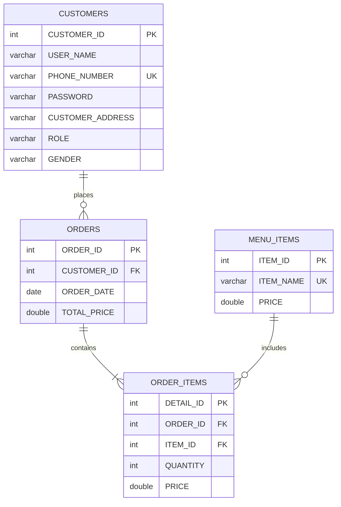

</div>

### 📋 Table Descriptions

| Table | Description | Key Fields |
|:-----:|-------------|------------|
| `Customers` | User accounts (customers & admins) | `PHONE_NUMBER` (unique), `ROLE` (Admin/User) |
| `Menu_Items` | Products catalog | `ITEM_NAME` (unique), `PRICE` |
| `Orders` | Transaction records | `CUSTOMER_ID` (FK), `TOTAL_PRICE` |
| `Order_Items` | Items per order (junction table) | `ORDER_ID` (FK), `ITEM_ID` (FK), `QUANTITY` |

### 🔗 Database Relationships

| Relationship | Type | Cascade |
|:------------:|:----:|:-------:|
| Customers → Orders | One-to-Many | ✅ ON DELETE CASCADE |
| Orders → Order_Items | One-to-Many | ✅ Linked via FK |
| Menu_Items → Order_Items | One-to-Many | ✅ Linked via FK |

> 💡 **Note:** `ON DELETE CASCADE` ensures that when a customer is deleted, all their orders are automatically removed.

### 🍽️ Sample Menu Items

<!-- 🏃 BOUNCING FOOD EMOJIS 🏃 -->
<div align="center">


</div>

| Item | Price (EGP) |
|:----:|:-----------:|
| ☕ Coffee | 50 |
| 🥛 Latte | 100 |
| 🍰 Cake | 80 |
| 🥪 Sandwich | 110 |
| 🍨 Ice Cream | 30 |
| 🍵 Tea | 40 |

---

<div align="center">

</div>

<!-- 🎮 INTERACTIVE TROUBLESHOOTING SECTION 🎮 -->
<div align="center">

</div>

<!-- 🎮 GAME-STYLE ERROR BADGES 🎮 -->
<div align="center">

|  Issue |  Solution |
|:------|:---------|
|  | ✅ Ensure JDBC driver is added to project libraries |
|  | ✅ Verify credentials in `DBConnection.java` |
|  | ✅ Check if MySQL service is running |
|  | ✅ Re-import `database_setup.sql` |

</div>

---

<div align="center">

</div>

<!-- 🔒 3D SECURITY SECTION 🔒 -->
<div align="center">

</div>

## 🔐 Technical Highlights

### Code Quality
| Feature | Implementation |
|---------|---------------|
| **Data Passing** | Parameterized constructors between frames |
| **SQL Security** | Prepared statements to prevent injection |
| **Error Handling** | Try-catch blocks with user-friendly messages |
| **Code Organization** | Alphabetical prefix naming (A→E) for navigation flow |

### Database Integrity
```sql
-- Cascade Delete Example
ALTER TABLE orders 
ADD CONSTRAINT fk_customer 
FOREIGN KEY (CUSTOMER_ID) REFERENCES customers(CUSTOMER_ID) 
ON DELETE CASCADE;
```

### UI/UX Enhancements
- 🎨 Transparent text fields with rounded corners
- 👁️ Password visibility toggle (Show/Hide)
- 🖱️ Double-click event for order details popup
- 📱 Consistent design language across all frames

---

<div align="center">

</div>

<!-- 🌈 MORPHING GRADIENT SECTION 🌈 -->
<div align="center">

</div>

<div align="center">

<!-- 🎮 INTERACTIVE STATUS BADGES 🎮 -->

| Priority | Feature | Status |
|:--------:|---------|:------:|
| ✅ Done | Wallet system with transactions | ✅ Completed v2.0 |
| ✅ Done | Order history with details popup | ✅ Completed v2.0 |
| ✅ Done | User profile dashboard | ✅ Completed v2.0 |
| 🔴 High | Export sales reports to PDF/Excel | 📋 Planned |
| 🟡 Medium | Customer loyalty program | 💭 Idea |
| 🟡 Medium | Multi-language support | 💭 Idea |
| 🟢 Low | Dark mode theme | 💭 Idea |
| 🟢 Low | Mobile companion app | 💭 Idea |

---

<div align="center">

</div>

## 🤝 Contributing

Contributions are welcome! Here's how you can help:

1. 🍴 **Fork** the repository
2. 🔧 **Create** a feature branch (`git checkout -b feature/AmazingFeature`)
3. 💾 **Commit** your changes (`git commit -m 'Add AmazingFeature'`)
4. 📤 **Push** to the branch (`git push origin feature/AmazingFeature`) 
5. 🔃 **Open** a Pull Request

> Please read our contribution guidelines before submitting a PR.

<!-- ✨ ANIMATED GRADIENT LINE ✨ -->


## 👨‍💻 Team Members

<div align="center">

<!-- 💎 CRYSTAL DIVIDER 💎 -->


<!-- 🌊 WAVE TITLE 🌊 -->


<!-- 🏃 BOUNCING TEAM EMOJIS 🏃 -->


<br><br>

<table>
  <tr>
    <td align="center">
      <br>
      <b>Abdullah Darahem</b><br>
    </td>
    <td align="center">
      <br>
      <b>Zeyad Salim</b><br>
    </td>
    <td align="center">
      
      <br>
      <b>Rana Ehgannam</b><br>
    </td>
  </tr>
  <tr>
    <td align="center">
      
      <br>
      <b>Rewan Reda</b><br>
    </td>
    <td align="center">
      
      <br>
      <b>Rawaa Elsayed</b><br>
    </td>
    <td align="center">
      
      <br>
      <b>Rawan Osama</b><br>
    </td>
  </tr>
</table>

<!-- Team Fun Stats -->
<br>

| ☕ Coffees Consumed | 💻 Lines of Code | 🐛 Bugs Fixed | 😴 Sleepless Nights |
|:------------------:|:----------------:|:-------------:|:-------------------:|
| 200+ | 5000+ | 100+ | Many! 😅 |

</div>

<!-- ✨ ANIMATED GRADIENT LINE ✨ -->


## 📅 Development Timeline

<div align="center">

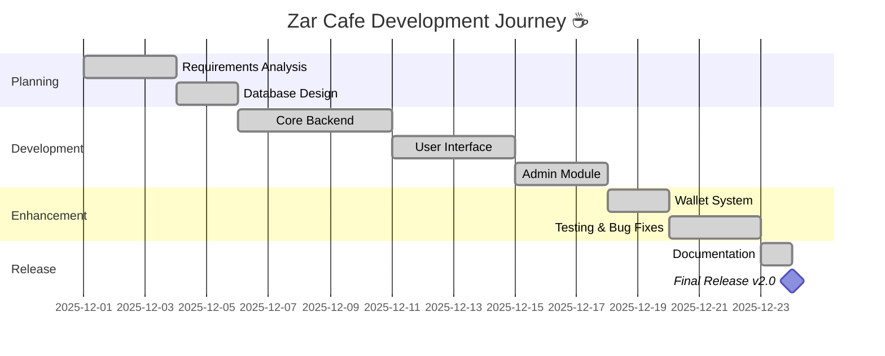

</div>

<!-- ✨ ANIMATED GRADIENT LINE ✨ -->


## 🎉 Fun Facts

<div align="center">

<!-- 🎯 3D ANIMATED COFFEE CUP 🎯 -->


<!-- 🌊 WAVE EFFECT TITLE 🌊 -->


</div>

| 🎯 Did You Know? |
|-----------------|
| ☕ The team consumed enough coffee to fill a small swimming pool |
| 🌙 Most commits were made between midnight and 3 AM |
| 🐛 The first bug took 4 hours to fix - it was a missing semicolon |
| 🎨 The UI was redesigned 5 times before we got it right |
| 💡 The name "Zar" comes from team brainstorming session |
| 🎵 Lo-fi hip hop was our coding soundtrack |

---

<!-- 🏅 ACHIEVEMENT BADGES 🏅 -->
<div align="center">

## 🏅 Achievement Unlocked!

<!-- 🎮 ANIMATED GAMING HEADER 🎮 -->


<br>


| 🎖️ Achievement | 📋 Description | ✅ Status |
|:-------------:|:--------------|:--------:|
| 🚀 **First Commit** | Made the initial commit |  |
| ☕ **Coffee Addict** | Consumed 100+ cups of coffee |  |
| 🐛 **Bug Slayer** | Fixed 50+ bugs |  |
| 🌙 **Night Owl** | Coded past midnight 10+ times |  |
| 📚 **Documentation Hero** | Wrote 800+ lines of README |  |
| 💻 **Code Warrior** | Wrote 5000+ lines of code |  |
| 🎨 **UI Perfectionist** | Redesigned UI 5 times |  |
| 🤝 **Team Player** | 6 members worked in harmony |  |
| ⭐ **Rising Star** | Got first GitHub star |  |
| 🌟 **Superstar** | Reached 100 stars |  |

</div>

---

<!-- 🎨 COLOR PALETTE SHOWCASE 🎨 -->
<div align="center">

## 🎨 App Color Palette

*The beautiful coffee-inspired colors of Zar Cafe*

| Color | Hex | Preview | Usage |
|:-----:|:---:|:-------:|:------|
| ☕ Dark Espresso | `#4A2C2A` |  | Headers, Buttons |
| 🤎 Coffee Brown | `#6F4E37` |  | Primary Color |
| 🍂 Caramel | `#A67B5B` |  | Accents |
| 🥛 Cream | `#FFF8DC` |  | Text, Backgrounds |
| 🍞 Wheat | `#DEB887` |  | Secondary Text |
| 🥐 Warm Beige | `#F5DEB3` |  | Hover States |

</div>

---

<!-- ⌨️ KEYBOARD SHORTCUTS ⌨️ -->
<div align="center">

## ⌨️ Keyboard Shortcuts

*Speed up your workflow with these handy shortcuts*


| Shortcut | Action | Module |
|:--------:|:------:|:------:|
| <kbd>Enter</kbd> | Submit Form | Login/Signup |
| <kbd>Esc</kbd> | Close Dialog | All |
| <kbd>Double-Click</kbd> | View Order Details | User Profile |
| <kbd>Tab</kbd> | Navigate Fields | All Forms |
| <kbd>F5</kbd> | Refresh Data | Admin Panel |
| <kbd>Ctrl</kbd>+<kbd>S</kbd> | Save Changes | Menu Editor |
| <kbd>Delete</kbd> | Remove Selected | Cart/Admin |

</div>

---

<div align="center">

</div>

<!-- 📝 ANIMATED CHANGELOG HEADER 📝 -->
<div align="center">

</div>

### 🚀 Version 2.0.0 (December 2025)

<!-- 🌟 NEW VERSION ANIMATED BADGE 🌟 -->
<div align="center">


</div>
<br>

#### 💰 New Features
- **Wallet System:** Electronic wallet for cashless payments
- **Transaction History:** Complete log of all wallet activities
- **Profile Dashboard:** View balance and personal information
- **Order History:** Browse past orders in a table format
- **Quick Details Popup:** Double-click orders to see item breakdown

#### 🛠️ Improvements
- **Show/Hide Password:** Toggle visibility in login & signup forms
- **Modern UI:** Transparent fields with rounded borders
- **Discount Support:** Orders now track subtotal, discount, and total
- **Cascade Delete:** Safe user deletion with automatic cleanup
- **Menu Inventory:** Track product quantities and images

#### 🔧 Technical Updates
- Removed unused `GENDER` column from database
- Added `WALLET_BALANCE` to customers table
- New `wallet_transactions` table for financial tracking
- Implemented `ON DELETE CASCADE` for data integrity
- Parameterized constructors for secure data passing

### 📦 Version 1.0.0 (December 2025)
- 🎉 Initial release
- ✅ User authentication (Login/Signup)
- ✅ Order management system
- ✅ Admin dashboard
- ✅ Basic POS functionality

<!-- ✨ ANIMATED GRADIENT LINE ✨ -->


## 🙏 Acknowledgments

<div align="center">

<!-- 💖 ANIMATED HEARTS 💖 -->


<!-- 🌊 WAVE THANK YOU 🌊 -->


> 
> *"Life begins after coffee"* — Every Developer Ever

</div>

- 🎓 Our professors and mentors for guidance
- ☕ Coffee for keeping us awake during development
- 📚 Online resources and documentation
- 💡 Open source community for inspiration
- 🌟 Everyone who stars and supports this project

<!-- ✨ ANIMATED GRADIENT LINE ✨ -->


## 📄 License

This project is developed for **educational purposes** as part of a Software Engineering course.

```
MIT License - Feel free to use this project for learning purposes.
```

<!-- ✨ ANIMATED GRADIENT LINE ✨ -->


<div align="center">

## 🌟 Star History

[](https://star-history.com/#abdullah-darahem/ZarCafe_System&Date)

</div>

<!-- ✨ ANIMATED GRADIENT LINE ✨ -->


<div align="center">

### 💖 Support the Project

<!-- 🌟 EPIC STAR ANIMATION 🌟 -->


<h3>🌟 YOU ARE STAR #! 🌟</h3>

**If you found this project helpful, please give it a star!**

[](https://github.com/abdullah-darahem/ZarCafe_System/stargazers)

<!-- ☕ ANIMATED COFFEE BUTTON ☕ -->
<br>
<a href="#">
  
</a>
<a href="#">
  
</a>
<a href="#">
  
</a>

---

<!-- 📱 QR CODE SECTION 📱 -->
<h3>📱 Scan to Access Repository</h3>


*Scan with your phone to visit the repository instantly!*

---

<!-- 🔥 ACTIVITY STREAK ANIMATION 🔥 -->
<h3>🔥 Project Activity</h3>


| 📆 Stat | 📊 Value |
|:-------:|:--------:|
| 🗓️ Days Active | 24 |
| 💻 Total Commits | 50+ |
| 🔀 Merge Requests | 15+ |
| 🐛 Issues Closed | 20+ |
| ⚡ Avg. Commits/Day | 2+ |


---

<!-- 🌐 CONNECT WITH US -->
<h3>🌐 Connect With The Team</h3>

<p>
<a href="mailto:zarcafe@example.com"></a>
<a href="#"></a>
<a href="#"></a>
</p>

---

<!-- 👋 EPIC ANIMATED GOODBYE 👋 -->


<!-- 🌟 EPIC FINAL MESSAGE 🌟 -->
<br>

<br><br>


**Made with ❤️ and lots of ☕ by the Zar Cafe Team**


<!-- 🌟 ANIMATED TYPING BANNER 🌟 -->
<br>


*© 2025 Zar Cafe System. All Rights Reserved.*

[⬆ Back to Top](#)

<!-- 🌈 FINAL RAINBOW LINE 🌈 -->


</div>

<!-- ☕ EPIC ANIMATED COFFEE FOOTER ☕ -->
