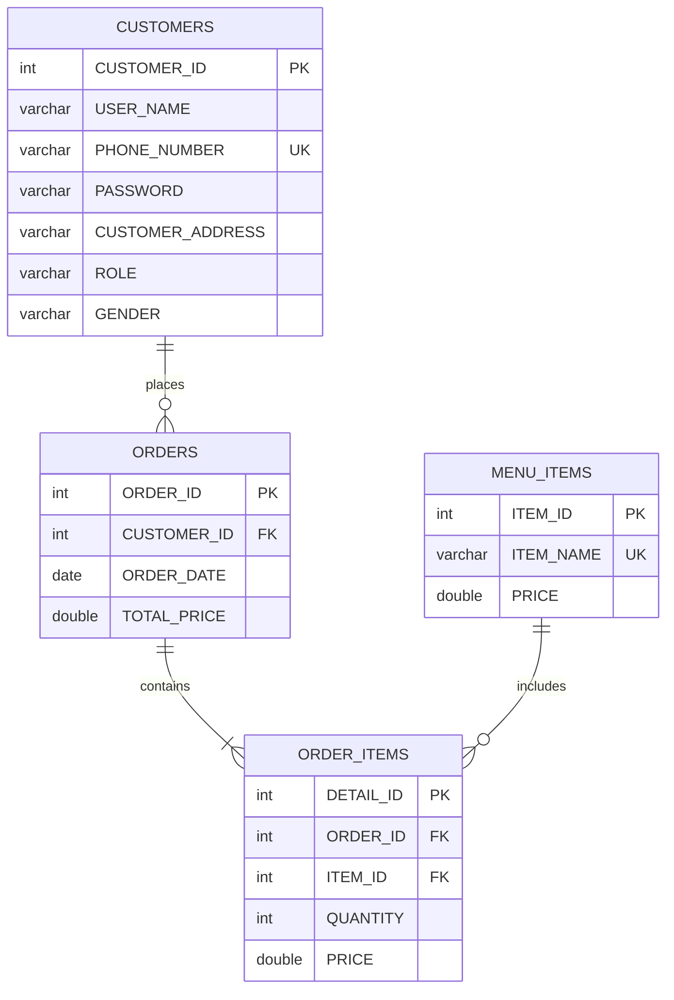

<div align="center">

<!-- 🚀 COSMIC INTRO ANIMATION -->


<!-- Matrix/Code Rain Effect -->


<!-- Animated Header -->


<!-- Neon Glow Line -->


<!-- Animated Typing Effect -->
[](https://git.io/typing-svg)

<!-- Animated Coffee -->


<!-- Space Elements -->


<!-- Visitor Counter -->


<!-- 🌌 HOLOGRAPHIC TECH STACK -->
<p align="center">
  
  
  
  
</p>

<p align="center">
  
</p>


<!-- Alien & UFO Fun -->
<p align="center">


</p>

[](https://github.com/abdullah-darahem/ZarCafe_System/stargazers)
[](https://github.com/abdullah-darahem/ZarCafe_System/network/members)
[](https://github.com/abdullah-darahem/ZarCafe_System/watchers)

<p align="center">
  <strong>A college-level Point of Sale (POS) desktop application developed as a software engineering project.</strong><br>
  This system streamlines coffee shop operations using a structured <b>Java Swing</b> interface and <b>MySQL</b> database.
</p>

[Features](#-key-features) • [Installation](#️-installation--setup-guide) • [Screenshots](#-application-tour) • [Team](#-team-members)

<br>

### 🎬 Watch Full Demo

[](https://drive.google.com/file/d/12ca1i_MeDqMy2uFxcE-72gWRjlKziEVQ/view)

*Click the button above to watch the complete 5-minute walkthrough*

<!-- Quick Action Buttons -->
<br>

[](https://github.com/abdullah-darahem/ZarCafe_System.git)
[](https://github.com/abdullah-darahem/ZarCafe_System/archive/refs/heads/main.zip)
[](https://github.com/abdullah-darahem/ZarCafe_System/issues)
[](https://github.com/abdullah-darahem/ZarCafe_System/issues)

</div>

<!-- 🌠 COSMIC NEON DIVIDER -->


<div align="center">

</div>

## 📑 Table of Contents

<details>
<summary>Click to expand</summary>

- [Demo](#-watch-full-demo)
- [Application Tour](#-application-tour)
- [Key Features](#-key-features)
- [Tech Stack](#️-tech-stack)
- [Prerequisites](#-prerequisites)
- [Installation & Setup](#️-installation--setup-guide)
- [Project Structure](#-project-structure)
- [Troubleshooting](#-troubleshooting)
- [Future Enhancements](#-future-enhancements)
- [Contributing](#-contributing)
- [Team Members](#-team-members)
- [Changelog](#-changelog)
- [Acknowledgments](#-acknowledgments)

</details>

<!-- 🌠 COSMIC NEON DIVIDER -->


## 📸 Application Tour

<div align="center">

<!-- Floating Astronaut -->


>  *Explore our beautiful, intuitive interface*

</div>

The application follows a structured user flow with **alphabetical prefixes (A → E)** for intuitive navigation.

<details>
<summary>🖼️ <b>Click to Expand Full Screenshot Gallery</b></summary>
<br>

### 🅰️ Entry Point
| Welcome Screen |
|:---:|
|  |
| `A__Welcome.java` - Application launcher |

### 🅱️ Authentication Module
| Login | Signup |
|:---:|:---:|
|  |  |
| `B__Login.java` - Secure access | `B__Signup.java` - New registration |

### 🅲 Information Center
| About Us | Contact Us |
|:---:|:---:|
|  |  |
| `C__About_us.java` | `C__contact_us.java` |

### 🅳 User Module
| Order System | Profile & Wallet |
|:---:|:---:|
|  |  |
| `D__User_ORDERS.java` - POS Interface | `D__Order_PROFILE.java` - User Dashboard |

### 🅴 Admin Module
| Dashboard | Menu Management | Sales Reports | User Management |
|:---:|:---:|:---:|:---:|
|  |  |  |  |
| `E__Admin_1.java` | `E__Admin_MENU.java` | `E__Admin_SALES.java` | `E__Admin_USERS.java` |

</details>

<!-- 🌠 COSMIC NEON DIVIDER -->


<div align="center">

<!-- Coding Animation -->


</div>

## 🚀 Key Features

### 👤 A. & B. User Access Control
* **Welcome Hub:** centralized entry point guiding users to login or register.
* **Role-Based Login:** secure authentication separating 'Admin' access from standard 'User' access.
* **Smart Signup:** streamlined registration form with duplicate phone validation.
* **🆕 Show/Hide Password:** toggle checkbox for password visibility in both fields.
* **🆕 Modern UI:** transparent text fields with rounded borders for a sleek look.

### 💰 Wallet System (NEW!)
* **Electronic Wallet:** each customer has a wallet balance for cashless transactions.
* **Transaction History:** complete log of deposits and withdrawals with timestamps.
* **Secure Payments:** deduct from wallet balance during checkout.

### 🛒 D. Order Processing (The Core)
* **Visual Menu:** categorized selection for Coffee, Bakery, and Desserts.
* **Dynamic Cart:** real-time bill calculation and item management.
* **🆕 Discount Support:** orders now support subtotal, discount, and final total.
* **Receipt Generation:** automated generation of order summaries.

### 👤 Profile & Order History (NEW!)
* **Profile Dashboard:** view wallet balance and personal info.
* **Order History Table:** browse all past orders in a clean table.
* **🆕 Quick Details (Double-Click):** double-click any order to see full item breakdown in a popup.

### 📊 E. Admin Administration
* **Sales Overview:** view daily earnings and transaction logs.
* **🆕 Full CRUD Control:** add, edit, and delete users with cascade deletion.
* **🆕 Safe Delete:** delete any user along with all their orders automatically.
* **Menu Management:** add new products, update prices, and manage inventory.

### ℹ️ C. Information Center
* **About & Contact:** dedicated interfaces providing project information and developer contact details.

<!-- 🌠 COSMIC NEON DIVIDER -->


## 🛠️ Tech Stack

<div align="center">

<!-- Holographic Cube -->


>  *Built with industry-standard technologies*

| Component | Technology | Purpose |
|:---------:|:----------:|:--------|
|  | Java (JDK 8+) | Core Programming Language |
|  | Java Swing | GUI Framework |
|  | MySQL 5.7+ | Database Management |
|  | MySQL Connector | Database Connectivity |
|  | Apache NetBeans | Development IDE |

</div>

---

## 📋 Prerequisites

Before you begin, ensure you have the following installed:

| Requirement | Version | Download Link |
|:-----------:|:-------:|:-------------:|
| ☕ Java JDK | 8+ | [Download](https://www.oracle.com/java/technologies/downloads/) |
| 🗄️ MySQL Server | 5.7+ | [Download](https://dev.mysql.com/downloads/) |
| 💻 Apache NetBeans | Latest | [Download](https://netbeans.apache.org/download/) |

> 💡 **Tip:** You can also use [XAMPP](https://www.apachefriends.org/) which includes MySQL Server.

---

## ⚙️ Installation & Setup Guide

### ⚡ Quick Start
```bash
# 1. Clone the repository
git clone https://github.com/abdullah-darahem/ZarCafe_System.git

# 2. Import database/database_setup.sql into MySQL

# 3. Open project in NetBeans and run!
```

### 1. Database Setup 🗄️
1.  Open your SQL Server (Workbench or XAMPP).
2.  Import **`database_setup.sql`** from the `database/` folder.
3.  This creates the `ZAR_CAFE` DB and tables.

### 2. Configuration 🔌
Ensure database credentials match your local machine in `src/db/DBConnection.java`:
```java
private static final String URL = "jdbc:mysql://localhost:3306/ZAR_CAFE";
private static final String USER = "root"; // Check your username
private static final String PASSWORD = ""; // Check your password
```

### 3. Add JDBC Driver 📦
1.  Right-click your project → **Properties** → **Libraries**.
2.  Click **Add JAR/Folder** and select `lib/mysql-connector-java-x.x.x.jar`.

### 4. Run 🚀
Right-click the project and select **Run**.
* **Default Admin Credentials:**
    * Phone: `123`
    * Password: `admin123`
    
    > **Note:** For security purposes, please change these credentials after the first login or via the database.

---

## 📂 Project Structure
```
ZarCafe_System/
├── 📁 src/
│   ├── 📁 ui/
│   │   ├── 📄 A__Welcome.java          # Entry point - Welcome screen
│   │   ├── 📄 B__Login.java            # User authentication
│   │   ├── 📄 B__Signup.java           # New user registration
│   │   ├── 📄 C__About_us.java         # Team information
│   │   ├── 📄 C__contact_us.java       # Contact details
│   │   ├── 📄 D__Order_PROFILE.java    # User profile & wallet
│   │   ├── 📄 D__User_ORDERS.java      # Order menu & cart
│   │   ├── 📄 E__Admin_1.java          # Admin main dashboard
│   │   ├── 📄 E__Admin_MENU.java       # Menu management
│   │   ├── 📄 E__Admin_SALES.java      # Sales reports
│   │   └── 📄 E__Admin_USERS.java      # User management (CRUD)
│   ├── 📁 db/
│   │   └── 📄 DBConnection.java        # Database connection handler
│   └── 📁 images/                      # Icons and assets
├── 📁 database/
│   └── 📄 database_setup.sql           # SQL schema & sample data
├── 📁 lib/
│   └── 📄 mysql-connector-j-x.x.x.jar  # JDBC Driver
├── 📁 screenshots/                     # UI screenshots
└── 📄 README.md
```

### 🏗️ Architecture Overview

```
┌─────────────────────────────────────────────────────────────────┐
│                        ZAR CAFE SYSTEM                          │
├─────────────────────────────────────────────────────────────────┤
│  ┌─────────┐    ┌─────────┐    ┌─────────┐    ┌─────────┐      │
│  │    A    │───▶│    B    │───▶│    C    │    │    D    │      │
│  │ Welcome │    │  Login  │    │  Info   │    │  User   │      │
│  └─────────┘    │ Signup  │    │ About   │    │ Orders  │      │
│                 └────┬────┘    │ Contact │    │ Profile │      │
│                      │         └─────────┘    └────┬────┘      │
│                      │                             │            │
│                      ▼                             │            │
│               ┌─────────────────────────────────┐  │            │
│               │            E - ADMIN            │◀─┘            │
│               │  Dashboard │ Menu │ Sales │ Users│              │
│               └─────────────────────────────────┘              │
│                              │                                  │
│                              ▼                                  │
│                    ┌─────────────────┐                         │
│                    │  MySQL Database │                         │
│                    └─────────────────┘                         │
└─────────────────────────────────────────────────────────────────┘
```

---

## 📊 Database Schema

<div align="center">



</div>

### 📋 Table Descriptions

| Table | Description | Key Fields |
|:-----:|-------------|------------|
| `Customers` | User accounts (customers & admins) | `PHONE_NUMBER` (unique), `ROLE` (Admin/User) |
| `Menu_Items` | Products catalog | `ITEM_NAME` (unique), `PRICE` |
| `Orders` | Transaction records | `CUSTOMER_ID` (FK), `TOTAL_PRICE` |
| `Order_Items` | Items per order (junction table) | `ORDER_ID` (FK), `ITEM_ID` (FK), `QUANTITY` |

### 🔗 Database Relationships

| Relationship | Type | Cascade |
|:------------:|:----:|:-------:|
| Customers → Orders | One-to-Many | ✅ ON DELETE CASCADE |
| Orders → Order_Items | One-to-Many | ✅ Linked via FK |
| Menu_Items → Order_Items | One-to-Many | ✅ Linked via FK |

> 💡 **Note:** `ON DELETE CASCADE` ensures that when a customer is deleted, all their orders are automatically removed.

### 🍽️ Sample Menu Items

| Item | Price (EGP) |
|:----:|:-----------:|
| ☕ Coffee | 50 |
| 🥛 Latte | 100 |
| 🍰 Cake | 80 |
| 🥪 Sandwich | 110 |
| 🍨 Ice Cream | 30 |
| 🍵 Tea | 40 |

---

## ❓ Troubleshooting

| Issue | Solution |
|-------|----------|
| `ClassNotFoundException: com.mysql.cj.jdbc.Driver` | Ensure JDBC driver is added to project libraries |
| `Access denied for user 'root'` | Verify credentials in `DBConnection.java` |
| Database connection failed | Check if MySQL service is running |
| Tables not found | Re-import `database_setup.sql` |

---

## 🔐 Technical Highlights

### Code Quality
| Feature | Implementation |
|---------|---------------|
| **Data Passing** | Parameterized constructors between frames |
| **SQL Security** | Prepared statements to prevent injection |
| **Error Handling** | Try-catch blocks with user-friendly messages |
| **Code Organization** | Alphabetical prefix naming (A→E) for navigation flow |

### Database Integrity
```sql
-- Cascade Delete Example
ALTER TABLE orders 
ADD CONSTRAINT fk_customer 
FOREIGN KEY (CUSTOMER_ID) REFERENCES customers(CUSTOMER_ID) 
ON DELETE CASCADE;
```

### UI/UX Enhancements
- 🎨 Transparent text fields with rounded corners
- 👁️ Password visibility toggle (Show/Hide)
- 🖱️ Double-click event for order details popup
- 📱 Consistent design language across all frames

---

## 🔮 Future Enhancements

<div align="center">

<!-- Crystal Ball Animation -->


**🚀 Charting the course for intergalactic features 🚀**

</div>

| Priority | Feature | Status |
|:--------:|---------|:------:|
| ✅ Done | Wallet system with transactions | ✅ Completed v2.0 |
| ✅ Done | Order history with details popup | ✅ Completed v2.0 |
| ✅ Done | User profile dashboard | ✅ Completed v2.0 |
| 🔴 High | Export sales reports to PDF/Excel | 📋 Planned |
| 🟡 Medium | Customer loyalty program | 💭 Idea |
| 🟡 Medium | Multi-language support | 💭 Idea |
| 🟢 Low | Dark mode theme | 💭 Idea |
| 🟢 Low | Mobile companion app | 💭 Idea |

---

## 🤝 Contributing

<div align="center">


**🌌 Join Our Cosmic Mission! 🌌**

</div>

Contributions are welcome! Here's how you can help:

1. 🍴 **Fork** the repository
2. 🔧 **Create** a feature branch (`git checkout -b feature/AmazingFeature`)
3. 💾 **Commit** your changes (`git commit -m 'Add AmazingFeature'`)
4. 📤 **Push** to the branch (`git push origin feature/AmazingFeature`)
5. 🔃 **Open** a Pull Request

> Please read our contribution guidelines before submitting a PR.

---

## 👨‍💻 Team Members

<!-- 🌌 SPACE STATION TEAM -->
<div align="center">


### 🚀 Mission Control: The Cosmic Crew Behind Zar Cafe 🌟


<br><br>

<table>
  <tr>
    <td align="center">
      <br>
      <b>✨ Abdullah Darahem ✨</b><br>
      <sub>🚀 Mission Commander</sub><br>
      <sub><i>Lead Developer</i></sub>
    </td>
    <td align="center">
      <br>
      <b>✨ Zeyad Salim ✨</b><br>
      <sub>🛸 Systems Engineer</sub><br>
      <sub><i>Developer</i></sub>
    </td>
    <td align="center">
      <br>
      <b>✨ Rana Ehgannam ✨</b><br>
      <sub>🌟 Star Navigator</sub><br>
      <sub><i>Developer</i></sub>
    </td>
  </tr>
  <tr>
    <td align="center">
      <br>
      <b>✨ Rewan Reda ✨</b><br>
      <sub>🌌 Galaxy Architect</sub><br>
      <sub><i>Developer</i></sub>
    </td>
    <td align="center">
      <br>
      <b>✨ Rawaa Elsayed ✨</b><br>
      <sub>🔭 Cosmic Explorer</sub><br>
      <sub><i>Developer</i></sub>
    </td>
    <td align="center">
      <br>
      <b>✨ Rawan Osama ✨</b><br>
      <sub>🌠 Nebula Designer</sub><br>
      <sub><i>Developer</i></sub>
    </td>
  </tr>
</table>

<br>


<br>
<em>🌌 "From the cosmos to your coffee cup" 🌌</em>

</div>

---

## 📝 Changelog

### 🚀 Version 2.0.0 (December 2025)

#### 💰 New Features
- **Wallet System:** Electronic wallet for cashless payments
- **Transaction History:** Complete log of all wallet activities
- **Profile Dashboard:** View balance and personal information
- **Order History:** Browse past orders in a table format
- **Quick Details Popup:** Double-click orders to see item breakdown

#### 🛠️ Improvements
- **Show/Hide Password:** Toggle visibility in login & signup forms
- **Modern UI:** Transparent fields with rounded borders
- **Discount Support:** Orders now track subtotal, discount, and total
- **Cascade Delete:** Safe user deletion with automatic cleanup
- **Menu Inventory:** Track product quantities and images

#### 🔧 Technical Updates
- Removed unused `GENDER` column from database
- Added `WALLET_BALANCE` to customers table
- New `wallet_transactions` table for financial tracking
- Implemented `ON DELETE CASCADE` for data integrity
- Parameterized constructors for secure data passing

### 📦 Version 1.0.0 (December 2025)
- 🎉 Initial release
- ✅ User authentication (Login/Signup)
- ✅ Order management system
- ✅ Admin dashboard
- ✅ Basic POS functionality

---

## 🙏 Acknowledgments

<div align="center">

<!-- Grateful Heart Animation -->


> 
> *"In the vast cosmos, coffee is the fuel that powers our code"* — Martian Developers

</div>

- 🎓 Our professors and mentors for guidance
- ☕ Coffee for keeping us awake during development
- 📚 Online resources and documentation
- 💡 Open source community for inspiration
- 🌟 Everyone who stars and supports this project

---

## 📄 License

This project is developed for **educational purposes** as part of a Software Engineering course.

```
MIT License - Feel free to use this project for learning purposes.
```

---

<div align="center">

## 🌟 Star History

<!-- Orbiting Planets -->


[](https://star-history.com/#abdullah-darahem/ZarCafe_System&Date)

</div>

<!-- 🌌 COSMIC NEON DIVIDER -->


<div align="center">

<!-- 🚀 EPIC COSMIC FINALE -->


### 💖 Support the Cosmic Mission


**🚀 If this project was out of this world, give it a star! 🚀**

[](https://github.com/abdullah-darahem/ZarCafe_System/stargazers)

---

<!-- Space Party -->


**🌌 Made with ❤️, lots of ☕, and stardust by the Zar Cafe Cosmic Crew 🌌**


*"🛸 Beaming quality code from Mars since 2025 🛸"*

---

*© 2025 Zar Cafe System. All Rights Reserved Across the Galaxy.*

[⬆ Teleport to Top](#-zar-cafe-management-system)

<br>

<!-- Animated Alien Goodbye -->


<b>Live Long and Drink Coffee</b>


</div>

<!-- 🌊 COSMIC VENOM FOOTER -->
