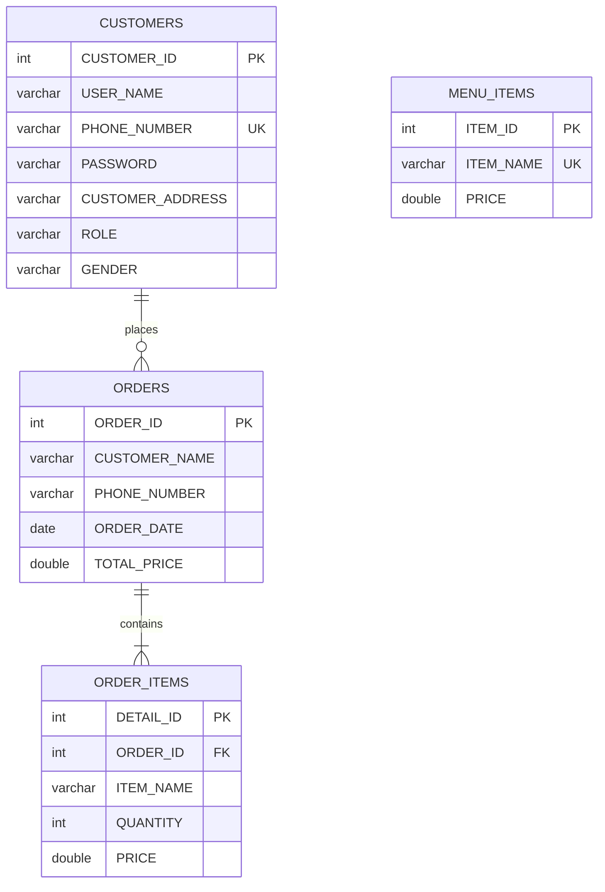

<div align="center">

# ☕ Zar Cafe Management System

### A Modern Point of Sale Solution for Coffee Shops


<p align="center">
  <strong>A college-level Point of Sale (POS) desktop application developed as a software engineering project.</strong><br>
  This system streamlines coffee shop operations using a structured <b>Java Swing</b> interface and <b>MySQL</b> database.
</p>

[Features](#-key-features) • [Installation](#️-installation--setup-guide) • [Screenshots](#-application-tour) • [Team](#-team-members)

</div>

---

## 📑 Table of Contents

<details>
<summary>Click to expand</summary>

- [Application Tour](#-application-tour)
- [Key Features](#-key-features)
- [Tech Stack](#️-tech-stack)
- [Prerequisites](#-prerequisites)
- [Installation & Setup](#️-installation--setup-guide)
- [Project Structure](#-project-structure)
- [Troubleshooting](#-troubleshooting)
- [Future Enhancements](#-future-enhancements)
- [Contributing](#-contributing)
- [Team Members](#-team-members)
- [Acknowledgments](#-acknowledgments)

</details>

---

## 📸 Application Tour
The application follows a structured user flow (A to E) for intuitive navigation.

### 1. Onboarding & Authentication
| Welcome Screen | Login | Signup |
|:---:|:---:|:---:|
|  |  |  |
| *Entry Point (A)* | *Secure Access (B)* | *New User Registration (B)* |

### 2. Core Modules
| Order System (User) | Admin Dashboard |
|:---:|:---:|
|  |  |
| *Main POS Interface (D)* | *Sales & Management (E)* |

### 3. Support & Info
| About Us | Contact Us |
|:---:|:---:|
|  |  |
| *Team Info (C)* | *Support Channels (C)* |

---

## 🚀 Key Features

### 👤 A. & B. User Access Control
* **Welcome Hub:** centralized entry point guiding users to login or register.
* **Role-Based Login:** secure authentication separating 'Admin' access from standard 'User' access.
* **Smart Signup:** streamlined registration form with validation.

### 🛒 D. Order Processing (The Core)
* **Visual Menu:** categorized selection for Coffee, Bakery, and Desserts.
* **Dynamic Cart:** real-time bill calculation and item management.
* **Receipt Generation:** automated generation of order summaries.

### 📊 E. Admin Administration
* **Sales Overview:** view daily earnings and transaction logs.
* **Database Control:** ability to manage records and view detailed order histories.

### ℹ️ C. Information Center
* **About & Contact:** dedicated interfaces providing project information and developer contact details.

---

## 🛠️ Tech Stack

<div align="center">

| Component | Technology | Purpose |
|:---------:|:----------:|:--------|
|  | Java (JDK 8+) | Core Programming Language |
|  | Java Swing | GUI Framework |
|  | MySQL 5.7+ | Database Management |
|  | MySQL Connector | Database Connectivity |
|  | Apache NetBeans | Development IDE |

</div>

---

## 📋 Prerequisites

Before you begin, ensure you have the following installed:

| Requirement | Version | Download Link |
|:-----------:|:-------:|:-------------:|
| ☕ Java JDK | 8+ | [Download](https://www.oracle.com/java/technologies/downloads/) |
| 🗄️ MySQL Server | 5.7+ | [Download](https://dev.mysql.com/downloads/) |
| 💻 Apache NetBeans | Latest | [Download](https://netbeans.apache.org/download/) |

> 💡 **Tip:** You can also use [XAMPP](https://www.apachefriends.org/) which includes MySQL Server.

---

## ⚙️ Installation & Setup Guide

### ⚡ Quick Start
```bash
# 1. Clone the repository
git clone https://github.com/yourusername/ZarCafe.git

# 2. Import database/database_setup.sql into MySQL

# 3. Open project in NetBeans and run!
```

### 1. Database Setup 🗄️
1.  Open your SQL Server (Workbench or XAMPP).
2.  Import **`database_setup.sql`** from the `database/` folder.
3.  This creates the `ZAR_CAFE` DB and tables.

### 2. Configuration 🔌
Ensure database credentials match your local machine in `src/db/DBConnection.java`:
```java
private static final String URL = "jdbc:mysql://localhost:3306/ZAR_CAFE";
private static final String USER = "root"; // Check your username
private static final String PASSWORD = ""; // Check your password
```

### 3. Add JDBC Driver 📦
1.  Right-click your project → **Properties** → **Libraries**.
2.  Click **Add JAR/Folder** and select `lib/mysql-connector-java-x.x.x.jar`.

### 4. Run 🚀
Right-click the project and select **Run**.
* **Default Admin Credentials:**
    * Phone: `123`
    * Password: `admin123`
    
    > **Note:** For security purposes, please change these credentials after the first login or via the database.

---

## 📂 Project Structure
```
ZarCafe/
├── 📁 src/
│   ├── 📁 ui/           # Java Swing GUI classes
│   ├── 📁 db/           # Database connection & queries
│   └── 📁 images/       # Icons and assets
├── 📁 database/
│   └── 📄 database_setup.sql
├── 📁 lib/
│   └── 📄 mysql-connector-java-x.x.x.jar
├── 📁 screenshots/
└── 📄 README.md
```

---

## 📊 Database Schema

<div align="center">



</div>

### 📋 Table Descriptions

| Table | Description | Key Fields |
|:-----:|-------------|------------|
| `customers` | User accounts (customers & admins) | `PHONE_NUMBER` (unique), `ROLE` (Admin/User) |
| `menu_items` | Coffee, Bakery, Dessert products | `ITEM_NAME` (unique), `PRICE` |
| `orders` | Transaction records | `ORDER_DATE`, `TOTAL_PRICE` |
| `order_items` | Individual items per order | `QUANTITY`, links to `orders` |

### 🍽️ Sample Menu Items

| Item | Price (EGP) |
|:----:|:-----------:|
| ☕ Coffee | 50 |
| 🥛 Latte | 100 |
| 🍰 Cake | 80 |
| 🥪 Sandwich | 110 |
| 🍨 Ice Cream | 30 |
| 🍵 Tea | 40 |

---

## ❓ Troubleshooting

| Issue | Solution |
|-------|----------|
| `ClassNotFoundException: com.mysql.cj.jdbc.Driver` | Ensure JDBC driver is added to project libraries |
| `Access denied for user 'root'` | Verify credentials in `DBConnection.java` |
| Database connection failed | Check if MySQL service is running |
| Tables not found | Re-import `database_setup.sql` |

---

## 🔮 Future Enhancements

| Priority | Feature | Status |
|:--------:|---------|:------:|
| 🔴 High | Inventory management system | 📋 Planned |
| 🔴 High | Export sales reports to PDF/Excel | 📋 Planned |
| 🟡 Medium | Customer loyalty program | 💭 Idea |
| 🟡 Medium | Multi-language support | 💭 Idea |
| 🟢 Low | Dark mode theme | 💭 Idea |
| 🟢 Low | Mobile companion app | 💭 Idea |

---

## 🤝 Contributing

Contributions are welcome! Here's how you can help:

1. 🍴 **Fork** the repository
2. 🔧 **Create** a feature branch (`git checkout -b feature/AmazingFeature`)
3. 💾 **Commit** your changes (`git commit -m 'Add AmazingFeature'`)
4. 📤 **Push** to the branch (`git push origin feature/AmazingFeature`)
5. 🔃 **Open** a Pull Request

> Please read our contribution guidelines before submitting a PR.

---

## 👨‍💻 Team Members

<div align="center">

This project was proudly developed by:

| 👤 Member | Role |
|:---------:|:----:|
| **Abdullah Darahem** | 💻 Developer |
| **Zeyad Salim** | 💻 Developer |
| **Rana Ehgannam** | 💻 Developer |
| **Rewan Reda** | 💻 Developer |
| **Rawaa Elsayed** | 💻 Developer |
| **Rawan Osama** | 💻 Developer |

</div>

---

## 🙏 Acknowledgments

- 🎓 Our professors and mentors for guidance
- ☕ Coffee for keeping us awake during development
- 📚 Online resources and documentation
- 💡 Open source community for inspiration

---

## 📄 License

This project is developed for **educational purposes** as part of a Software Engineering course.

```
MIT License - Feel free to use this project for learning purposes.
```

---

<div align="center">

### ⭐ Star this repository if you found it helpful!

**Made with ❤️ by the Zar Cafe Team**

*© 2025 Zar Cafe System. All Rights Reserved.*

[⬆ Back to Top](#-zar-cafe-management-system)

</div>